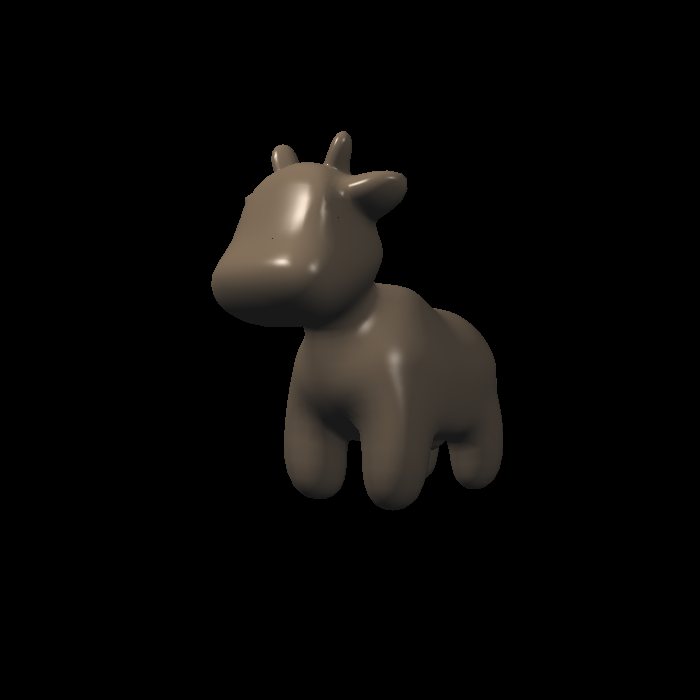
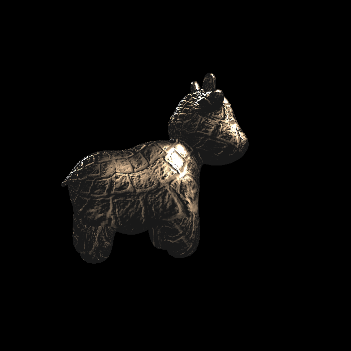
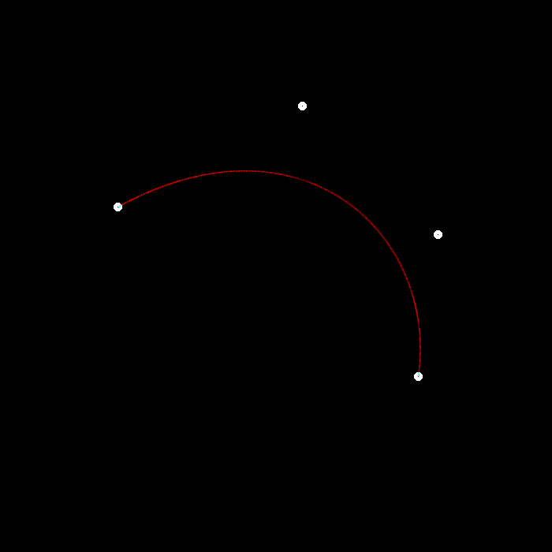
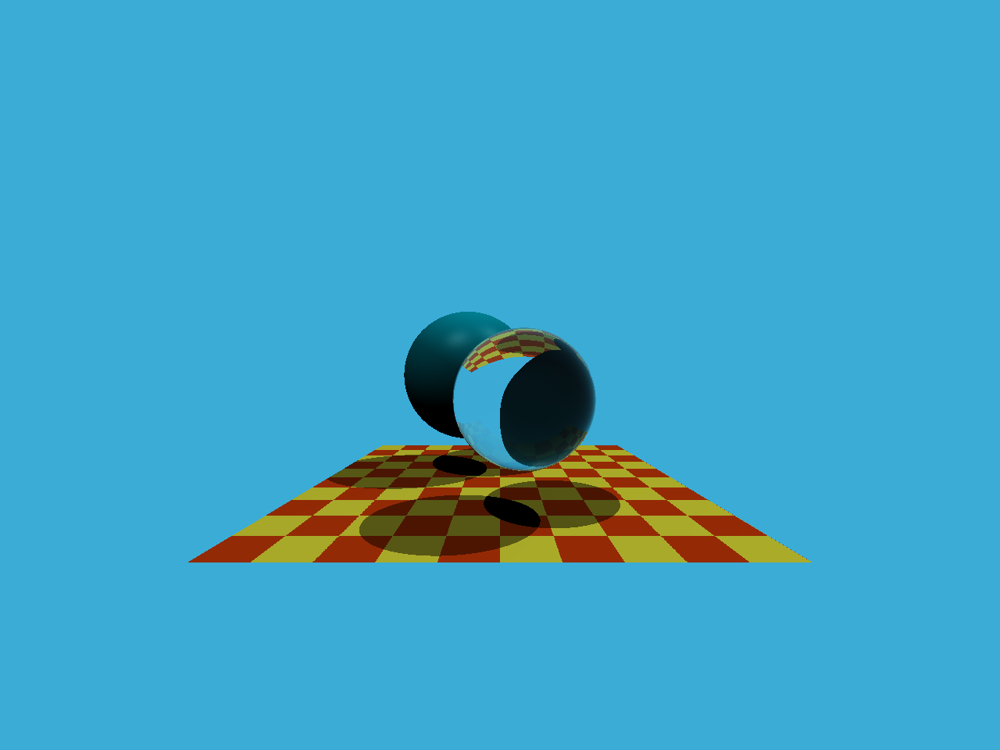
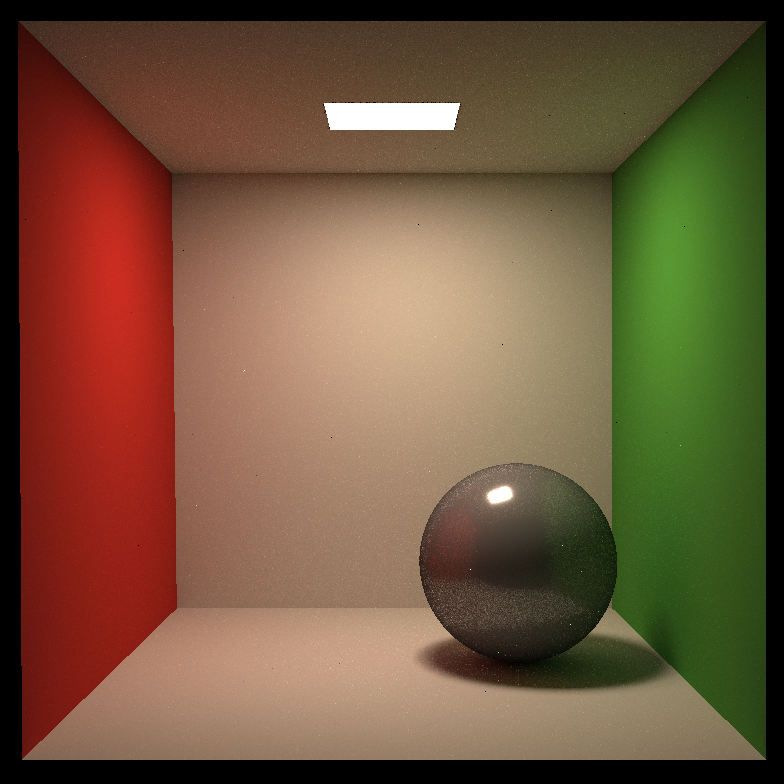

# 前言

这个仓库是我学习GAMES 图形学课程的代码练习备份。

# GAMES101 图形学入门

`GAMES101`文件夹中包含6个部分的练习代码，已经添加了合适的注释。

所有代码均可运行（需要配置OpenCV和Eigen库环境）。

注意，`launch.json`、`CMakeLists.txt`和代码文件中的路径需要更改。

具体包括：

- `launch.json`中的`"miDebuggerPath"`
- `CMakeLists.txt`中的：
  - `set(EIGEN3_INCLUDE_DIR "E:/Code/VSCode/library")`
  - `set(OpenCV_DIR "E:/Code/VSCode/library/opencv_4.8.0/opencv-build/install/x64/mingw/lib")`
- 代码文件中的绝对路径。如果使用相对路径，在调试时可能会报错

环境配置教程：

Opencv：[VScode+CMake+Opencv配置 - Blog of Mr.Juan (ljy0109.github.io)](https://ljy0109.github.io/2024/03/06/VScode+CMake+Opencv配置/)

Eigen：[关于CMake的一些用法 - Blog of Mr.Juan (ljy0109.github.io)](https://ljy0109.github.io/2024/03/06/关于CMake的一些用法/#3-eigen3eigencore-no-such-file-or-directory)

可以通过调试代码，并结合注释来理解算法原理。

- 光栅化三角形 `rasterizer_a_triangle` ，涉及到的内容：
  - Bresenham 直线光栅化算法
  - MVP模型视角投影变换矩阵
- 填充三角形 `z_buffer`：
  - 重心坐标插值
  - 透视矫正系数
  - Z_buffer\
  - SSAA（超采样反走样）& MSAA(多重采样反走样 Multisample anti aliasing)
- 纹理映射 `Texture map`：（代码中的Triangle顶点的初始化出现问题，在三维和四维之间出现了混乱，带注释的版本不能运行）
  - Blinn-Phong 反射模型
  - 凹凸贴图
  - 位移贴图 Displacement mapping
  - 法向量变换矩阵
  - 
  - 
- 贝塞尔曲线 `Bazier curve`：
  - de Casteljau 算法
  - 后续可以考虑实现B样条曲线和NURBS
  - 
- 循环光追 `Recursive (Whitted-Style) Ray Tracing`：
  - 菲涅尔反射方程
  - 折射方程的计算逻辑
  - Moller-Trumbore算法：快速求解射线与三角形的交点
  - 

- 路径追踪 `Path tracing`：
  - 切线空间：由局部坐标系到世界坐标系的转换
  - BVH：包围盒等级制度 Bounding Volume Hierarchy
  - SAH：Surface Area Heuristic（未实现）
  - 蒙特卡洛积分
  - 俄罗斯轮盘赌
  - 